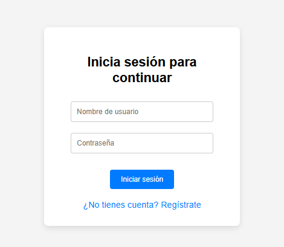
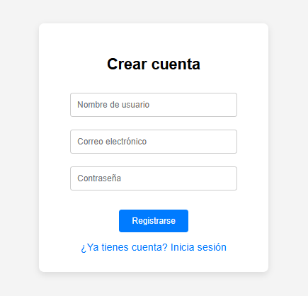
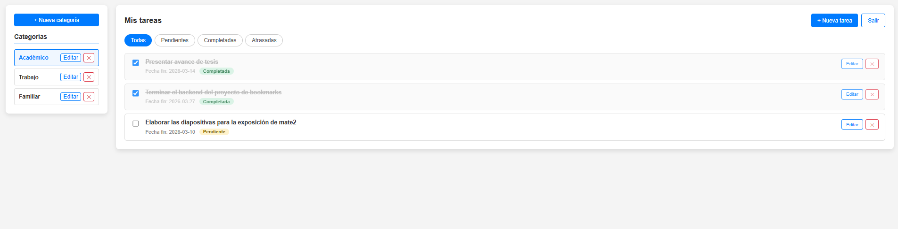
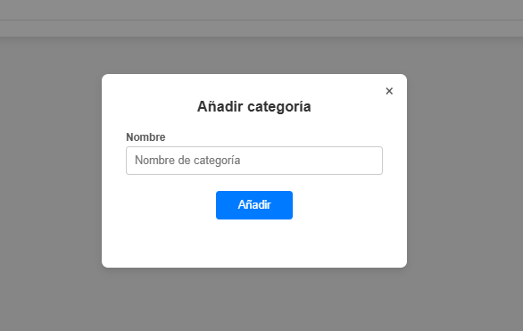
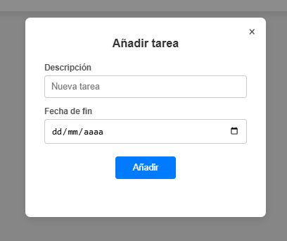

# Gestor de Tareas Personales

Una aplicación para gestionar tareas personales, construida con Django REST Framework y JWT para autenticación.

## Demo

### Pantalla de Login


### Registro


### Lista de tareas


### Añadir categoría


### Añadir tarea



## Características

-  **CRUD completo** de tareas y categorías (Crear, Leer, Actualizar, Eliminar)
-  **Autenticación JWT** (Access y Refresh tokens)
-  **Filtros** por estado de tarea (Todas/Pendientes/Completadas/Atrasadas) y por categoría
-  **Interfaz responsive** con HTML/CSS/JavaScript vanilla
-  **Refresco automático** de tokens

## Tecnologías utilizadas

### Backend
- **Django 6.0** - Framework web
- **Django REST Framework 3.16** - API REST
- **Simple JWT 5.5** - Autenticación por tokens
- **SQLite** - Base de datos (desarrollo)

### Frontend
- **HTML5** - Estructura
- **CSS3** - Estilos
- **JavaScript (Vanilla)** - Lógica de cliente
- **Fetch API** - Peticiones HTTP

## Dependencias
- Python: ver `requirements.txt`
- JavaScript: Axios (si se usa npm, ver `package.json`)

## Instalación

### Requisitos previos
- Python 3.10+
- pip (gestor de paquetes)
- Git

### Pasos de instalación

```bash
# 1. Clonar el repositorio
git clone https://github.com/angel2024-rgb/ProyectoGestorTareas.git
cd ProyectoGestorTareas

# 2. Crear y activar entorno virtual
python -m venv venv
# Windows:
venv\Scripts\activate
# Mac/Linux:
source venv/bin/activate

# 3. Instalar dependencias
pip install -r requirements.txt

# 4. Realizar migraciones
python manage.py migrate

# 5. Crear superusuario 
python manage.py createsuperuser

# 6. Ejecutar servidor
python manage.py runserver
```

## Cómo usar

1. **Accede a la aplicación**: http://127.0.0.1:8000/
2. **Regístrate** o inicia sesión
3. **Gestiona tus tareas**:
   - Crear nuevas categorías añadiendo el nombre
   - Seleccionar una categoría creada y crear nuevas tareas con descripción y fecha de fin
   - Filtrar las tareas por categoría y por estado (Todas/Pendientes/Completadas/Atrasadas)
   - Marcar las tareas como completadas/pendientes
   - Editar y eliminar categorías y tareas

## Estado
Proyecto en desarrollo activo. Se aceptan sugerencias y mejoras.