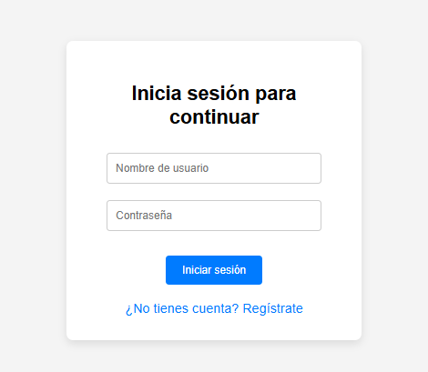
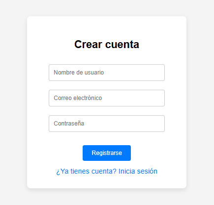
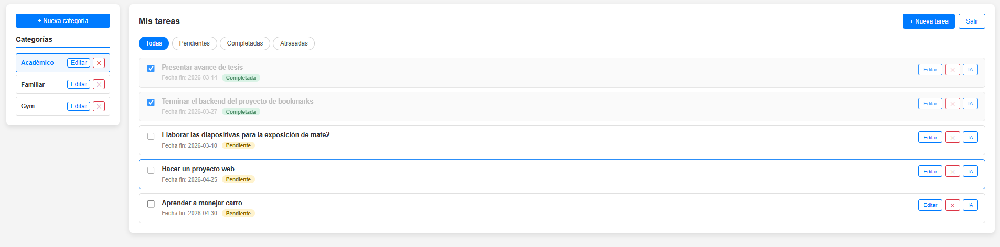
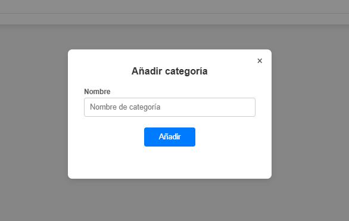
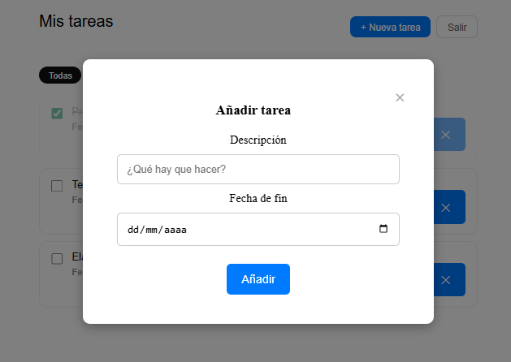
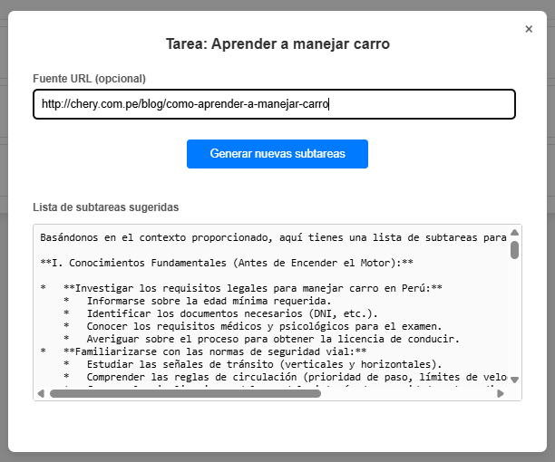

🇺🇸 English | 🇵🇪 [Versión en español](#español)

# Task Manager with AI – Personal Portfolio Project

A web app to organize your tasks, check the weather and news from Lima, and **generate subtasks automatically using AI** (Google Gemini).

**Frontend:** HTML, CSS and pure JavaScript.  
**Backend:** Django + Django REST Framework.

🔗 **Live demo**: [https://proyectogestortareas-31mw.onrender.com](https://proyectogestortareas-31mw.onrender.com)

---

## ✨ What you can do

- 📝 Create, edit, delete tasks and categories  
- 🌦️ See current weather in Lima  
- 📰 Read recent news headlines  
- 🤖 **Generate subtasks with AI** – from your task (optionally add a web link) and the AI will break it down into steps.

---

## 📸 Screenshots

### Login Screen with Weather and News

### Register

### Task List

### Add Category

### Add Task

### Generate list of subtasks using AI

---

## Tech Stack

### Backend
- Django, Django REST Framework, JWT authentication

### Frontend
- HTML, CSS, JavaScript (pure, no frameworks)

### AI
- Google Gemini API (for subtasks and semantic search)

### Database
- SQLite (local) / PostgreSQL (production)

---

## Notes
- Weather data: Open-Meteo (free)
- News: NewsAPI (requires free API key)
- AI subtask generation: limited to 10 requests/day on free tier

---

🇺🇸 [English](#task-manager-with-ai-personal-portfolio-project) | 🇵🇪 Versión en español

# Gestor de Tareas con IA – Proyecto de Portafolio Personal

Aplicación web para organizar tus tareas, consultar el clima y las noticias de Lima, y **generar subtareas automáticamente con IA** (Google Gemini).

**Frontend:** HTML, CSS y JavaScript puro.  
**Backend:** Django + Django REST Framework.

🔗 **Demo en vivo**: [https://proyectogestortareas-31mw.onrender.com](https://proyectogestortareas-31mw.onrender.com)

---

## ✨ Lo que puedes hacer

- 📝 Crear, editar y eliminar tareas y categorías  
- 🌦️ Ver el clima actual en Lima  
- 📰 Leer titulares de noticias recientes  
- 🤖 **Generar subtareas con IA** – a partir de tu tarea (opcionalmente añade un enlace web) y la IA la desglosará en pasos.

---

## 📸 Capturas de pantalla

### Pantalla de Login con Clima y Noticias

### Registro

### Lista de Tareas

### Añadir Categoría

### Añadir Tarea

### Generar lista de subtareas con IA

---

## Tecnologías utilizadas

### Backend
- Django, Django REST Framework, autenticación JWT

### Frontend
- HTML, CSS, JavaScript (puro, sin frameworks)

### IA
- API de Google Gemini (para subtareas y búsqueda semántica)

### Base de datos
- SQLite (local) / PostgreSQL (producción)

---

## Notas
- Datos del clima: Open-Meteo (gratuito)
- Noticias: NewsAPI (requiere clave API gratuita)
- Generación de subtareas con IA: limitada a 10 peticiones/día en el plan gratuito

---

## 👤 Autor

Angel Paredes – [GitHub](https://github.com/angel2024-rgb)